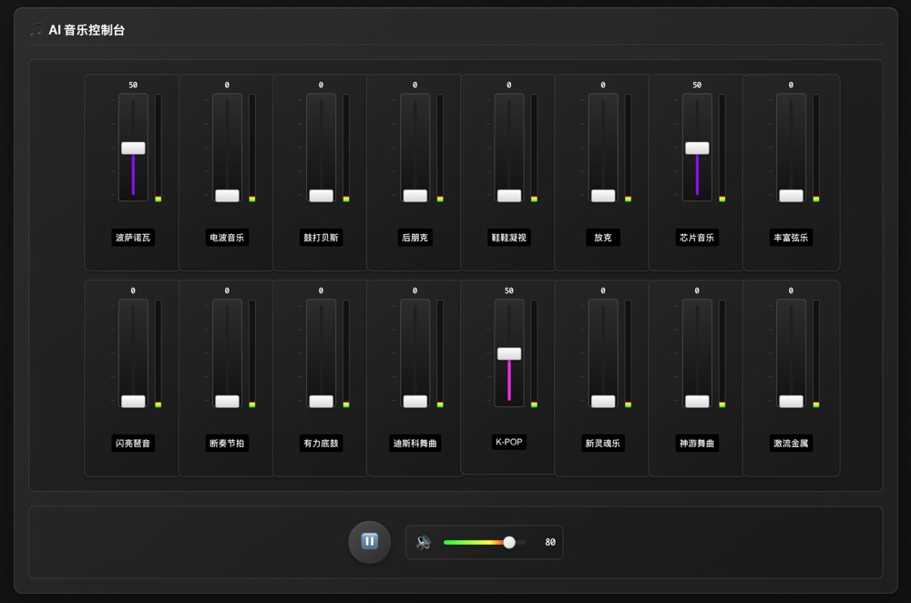

# AI 音乐控制台 (AI Music Panel)



一个基于 Google Gemini AI 的实时音乐生成控制台，支持通过推子和 MIDI 控制器实时调节音乐风格。

## 快速开始

**前提条件：** Node.js

1. **安装依赖：**
   ```bash
   npm install
   ```

2. **配置 API 密钥：**
   创建 `.env.local` 文件并设置您的 Gemini API 密钥：
   ```
   GEMINI_API_KEY=your_api_key_here
   ```

3. **运行应用：**
   ```bash
   npm run dev
   ```

## 核心功能

### 🎵 实时音乐风格控制
- **16种音乐风格**：波萨诺瓦、电波音乐、鼓打贝斯、后朋克、鞋履凝视、放克、芯片音乐等
- **推子控制**：通过推子实时调节各音乐风格的权重(0-4倍增益)
- **实时混合**：支持多种风格同时混合生成音乐

### 🎛️ 专业音频控制
- **音量控制**：独立的音量调节和静音功能
- **音频可视化**：每个激活推子都有实时音量指示条
- **智能指示**：未激活的推子音量条自动变暗

### 🔄 智能音乐生成
- **强制重启**：音乐风格变化不明显时可手动重启生成
- **自动重启**：权重显著变化时自动重新开始音乐生成
- **缓冲优化**：2秒音频缓冲确保流畅播放

### 🎹 MIDI 支持
- **MIDI 设备连接**：支持外部 MIDI 控制器
- **CC 映射**：每个推子可映射到不同的 MIDI CC
- **学习模式**：点击 CC 编号可进入 MIDI 学习模式

### 🌐 双语界面
- **中英文混合**：界面显示中文，AI 接收标准英文音乐术语
- **术语准确性**：使用标准音乐术语确保 AI 正确理解风格
- **用户友好**：中文界面降低使用门槛

## 音乐风格列表

| 中文名称 | 英文术语 | 风格特色 |
|---------|----------|----------|
| 波萨诺瓦 | Bossa Nova | 巴西轻柔爵士 |
| 电波音乐 | Synthwave | 80年代合成器音乐 |
| 鼓打贝斯 | Drum and Bass | 快节奏电子音乐 |
| 后朋克 | Post Punk | 实验性摇滚 |
| 鞋履凝视 | Shoegaze | 梦幻噪音摇滚 |
| 放克 | Funk | 节奏感强烈 |
| 芯片音乐 | Chiptune | 8位电子游戏音乐 |
| 丰富弦乐 | Rich Strings | 管弦乐编曲 |
| 闪亮琶音 | Sparkling Arpeggios | 明亮琶音效果 |
| 断奏节拍 | Staccato Beats | 短促节拍 |
| 有力底鼓 | Powerful Kick Drum | 强劲鼓点 |
| 迪斯科 | Disco | 70年代舞曲 |
| K-POP | K-POP | 韩国流行音乐 |
| 新灵魂乐 | Neo Soul | 现代灵魂乐 |
| 神游舞曲 | Trance | 迷幻电子舞曲 |
| 激流金属 | Thrash Metal | 激进金属音乐 |

## 操作指南

### 基本使用
1. **启动播放**：点击 ▶️ 按钮开始音乐生成
2. **调节风格**：拖动推子调节各音乐风格权重
3. **混合风格**：同时推起多个推子创建混合风格
4. **强制刷新**：如果风格变化不明显，点击 🔄 按钮

### 高级功能
- **MIDI 控制**：点击"MIDI 控制器"按钮连接外部设备
- **CC 学习**：点击推子下的 CC 编号进入学习模式
- **音量调节**：使用右侧音量控制调节整体音量
- **调试模式**：打开浏览器开发者工具查看详细日志

## 技术架构

### 前端技术栈
- **Lit Element**：轻量级 Web Components 框架
- **TypeScript**：类型安全的 JavaScript
- **Vite**：快速构建工具
- **Web Audio API**：实时音频处理

### AI 集成
- **Google Gemini**：实时音乐生成模型
- **权重控制**：动态调节音乐风格权重
- **流式播放**：低延迟音频流传输

### MIDI 支持
- **Web MIDI API**：浏览器原生 MIDI 支持
- **CC 映射**：Control Change 消息映射
- **设备检测**：自动检测 MIDI 设备

## 故障排除

### 常见问题

**Q: 音乐风格变化不明显？**
A: 
1. 确保推子权重足够高 (接近最大值)
2. 尝试多种风格混合
3. 点击 🔄 强制重启按钮
4. 检查控制台是否有"成功发送权重提示到AI"日志

**Q: 没有声音？**
A: 
1. 检查音量控制是否静音
2. 确保浏览器允许音频播放
3. 检查 API 密钥是否正确配置
4. 查看控制台错误日志

**Q: MIDI 控制器无法连接？**
A: 
1. 确保浏览器支持 Web MIDI API
2. 检查 MIDI 设备是否正确连接
3. 刷新页面重新检测设备

**Q: 推子不响应？**
A: 
1. 检查控制台是否有权重更新日志
2. 确认事件监听是否正常
3. 尝试刷新页面

## 开发说明

### 调试模式
应用内置了详细的调试日志：
- 权重更新日志
- AI 通信日志
- MIDI 事件日志
- 音频状态日志

### 扩展开发
- 添加新音乐风格：修改 `DEFAULT_PROMPTS` 配置
- 自定义 UI 组件：基于 Lit Element 开发
- MIDI 功能扩展：修改 `MidiDispatcher` 类

## 更新日志

### v1.2.0 (2025-01-08)
- ✨ 新增双语界面支持
- 🔧 修复音乐风格识别问题 (使用英文术语)
- 🎛️ 优化音量指示条显示逻辑
- ⚡ 扩大权重调节范围 (0-4)
- 🔄 添加强制重启功能
- 📊 增强调试日志系统

### v1.1.0
- 🎵 基本音乐风格控制
- 🎹 MIDI 控制器支持
- 📱 响应式界面设计

### v1.0.0
- 🚀 初始版本发布
- ⚡ 实时音乐生成
- 🎛️ 推子控制界面

## 许可证

Apache-2.0 License

## 贡献

欢迎提交 Issue 和 Pull Request！
