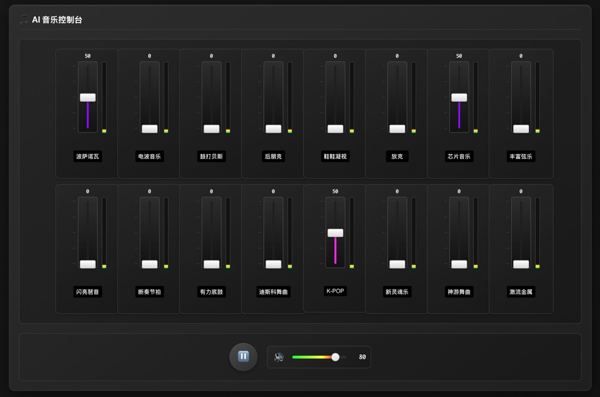

# AI Music Panel



> English Version | [中文版本](README.md)

A real-time music generation console based on Google Gemini AI, supporting real-time music style adjustment through faders and MIDI controllers.

## 🎵 Music Demo

Here's a sample audio recorded using the AI Music Panel:

<audio controls style="width: 100%; max-width: 600px;">
  <source src="ai-music-2025-06-07T00-29-59.webm" type="audio/webm">
  Your browser does not support audio playback.
</audio>

*Demo audio: AI-generated music mixing Bossa Nova, Synthwave, and Funk styles*

## Quick Start

**Prerequisites:** Node.js

1. **Install dependencies:**
   ```bash
   npm install
   ```

2. **Configure API Key:**
   Create a `.env.local` file and set your Gemini API key:
   ```
   GEMINI_API_KEY=your_api_key_here
   ```

3. **Run the application:**
   ```bash
   npm run dev
   ```

## Network Deployment

### 🌐 Important Network Configuration

⚠️ **Key Reminder: `localhost` ≠ `127.0.0.1`**

This is a common but important distinction in network deployment:

- **`localhost`**: Only accessible locally, cannot be accessed from external networks
- **`127.0.0.1`**: Also only accessible locally (loopback address)
- **`0.0.0.0`**: Listens on all network interfaces, can be accessed externally

### 📋 Deployment Configuration Guide

#### 1. Docker/Container Environment Deployment

**Problem Symptoms:**
- Container shows `➜ Local: http://localhost:5173/`
- External access fails (502 error)

**Solution:**
This project is configured with `--host 0.0.0.0`, ensure the following settings:

```javascript
// vite.config.ts
server: {
  host: '0.0.0.0',  // Listen on all network interfaces
  port: 5173
}
```

```json
// package.json
"scripts": {
  "dev": "vite --host 0.0.0.0"
}
```

#### 2. 1Panel Deployment Points

- **Internal port**: 5173
- **External mapped port**: 5173 (or custom)
- **Network mode**: bridge
- **Environment variables**: `GEMINI_API_KEY=your_key`

#### 3. Domain Configuration

**Problem Symptoms:**
- "This host is not allowed" error after binding domain
- Reverse proxy configured correctly but cannot access

**Solution:**
Configure allowed hosts in `vite.config.ts`:

```javascript
// vite.config.ts
server: {
  host: '0.0.0.0',
  port: 5173,
  allowedHosts: ['music.cflp.ai', 'localhost', '127.0.0.1']  // Add your domain
}
```

**Important Notes:**
- Service restart required after configuration changes
- Multiple domains can be added to `allowedHosts` array
- Keep `localhost` for local development

#### 4. Other Deployment Platforms

**VPS Deployment:**
```bash
# Ensure firewall opens port
sudo ufw allow 5173

# Use PM2 to manage process
pm2 start "npm run dev" --name ai-music-panel
```

**Nginx Reverse Proxy:**
```nginx
server {
    listen 80;
    server_name your-domain.com;
    
    location / {
        proxy_pass http://127.0.0.1:5173;
        proxy_http_version 1.1;
        proxy_set_header Upgrade $http_upgrade;
        proxy_set_header Connection 'upgrade';
        proxy_set_header Host $host;
        proxy_cache_bypass $http_upgrade;
    }
}
```

### 🔧 Network Debugging Tips

1. **Check port listening:**
   ```bash
   netstat -tlnp | grep 5173
   ```

2. **Test network connectivity:**
   ```bash
   curl http://your-server-ip:5173
   ```

3. **View container logs:**
   ```bash
   docker logs container-name
   ```

### 📱 Mobile Compatibility

This application is optimized for mobile support:
- Automatic mobile device detection
- Touch event optimization
- Responsive layout
- Audio context auto-activation

Dedicated operation tips are displayed when accessing from mobile devices.

## Core Features

### 🎵 Real-time Music Style Control
- **16 Music Styles**: Bossa Nova, Synthwave, Drum and Bass, Post Punk, Shoegaze, Funk, Chiptune, etc.
- **Fader Control**: Real-time adjustment of music style weights through faders (0-4x gain)
- **Real-time Mixing**: Support for simultaneous mixing of multiple styles

### 🎛️ Professional Audio Control
- **Volume Control**: Independent volume adjustment and mute functionality
- **Audio Visualization**: Real-time volume indicators for each active fader
- **Smart Indicators**: Inactive fader volume bars automatically dim

### 🔄 Intelligent Music Generation
- **Force Restart**: Manual restart when music style changes are not obvious
- **Auto Restart**: Automatic restart when weights change significantly
- **Buffer Optimization**: 2-second audio buffer ensures smooth playback

### 🎵 Audio Recording & Export
- **One-click Recording**: Real-time recording of generated AI music
- **WebM Format**: High-quality audio encoding with good compatibility
- **Real-time Timer**: Display duration during recording
- **Auto Download**: Automatic timestamp filename generation and download after recording

### 🎹 MIDI Support
- **MIDI Device Connection**: Support for external MIDI controllers
- **CC Mapping**: Each fader can be mapped to different MIDI CC
- **Learning Mode**: Click CC number to enter MIDI learning mode

### 🌐 Bilingual Interface
- **Chinese-English Mix**: Interface displays Chinese, AI receives standard English music terms
- **Terminology Accuracy**: Uses standard music terminology to ensure AI correctly understands styles
- **User-friendly**: Chinese interface lowers usage barriers

## Music Style List

| Chinese Name | English Term | Style Features |
|--------------|--------------|----------------|
| 波萨诺瓦 | Bossa Nova | Brazilian soft jazz |
| 电波音乐 | Synthwave | 80s synthesizer music |
| 鼓打贝斯 | Drum and Bass | Fast-paced electronic music |
| 后朋克 | Post Punk | Experimental rock |
| 鞋履凝视 | Shoegaze | Dreamy noise rock |
| 放克 | Funk | Strong rhythmic feel |
| 芯片音乐 | Chiptune | 8-bit video game music |
| 丰富弦乐 | Rich Strings | Orchestral arrangements |
| 闪亮琶音 | Sparkling Arpeggios | Bright arpeggio effects |
| 断奏节拍 | Staccato Beats | Short, crisp beats |
| 有力底鼓 | Powerful Kick Drum | Strong drum hits |
| 迪斯科 | Disco | 70s dance music |
| K-POP | K-POP | Korean pop music |
| 新灵魂乐 | Neo Soul | Modern soul music |
| 神游舞曲 | Trance | Psychedelic electronic dance music |
| 激流金属 | Thrash Metal | Aggressive metal music |

## Operation Guide

### Basic Usage
1. **Start Playback**: Click ▶️ button to start music generation
2. **Adjust Styles**: Drag faders to adjust music style weights
3. **Mix Styles**: Push up multiple faders simultaneously to create mixed styles
4. **Force Refresh**: Click 🔄 button if style changes are not obvious
5. **Record Music**: Click 🎙️ button to start recording, click again to stop and download

### Advanced Features
- **MIDI Control**: Click "MIDI Controller" button to connect external devices
- **CC Learning**: Click CC number below faders to enter learning mode
- **Volume Adjustment**: Use right-side volume control to adjust overall volume
- **Debug Mode**: Open browser developer tools to view detailed logs

## Technical Architecture

### Frontend Technology Stack
- **Lit Element**: Lightweight Web Components framework
- **TypeScript**: Type-safe JavaScript
- **Vite**: Fast build tool
- **Web Audio API**: Real-time audio processing

### AI Integration
- **Google Gemini**: Real-time music generation model
- **Weight Control**: Dynamic adjustment of music style weights
- **Streaming Playback**: Low-latency audio streaming

### MIDI Support
- **Web MIDI API**: Native browser MIDI support
- **CC Mapping**: Control Change message mapping
- **Device Detection**: Automatic MIDI device detection

## Troubleshooting

### Common Issues

**Q: Music style changes not obvious?**
A: 
1. Ensure fader weights are high enough (close to maximum)
2. Try mixing multiple styles
3. Click 🔄 force restart button
4. Check console for "Successfully sent weight prompt to AI" logs

**Q: No sound?**
A: 
1. Check if volume control is muted
2. Ensure browser allows audio playback
3. Check if API key is correctly configured
4. View console error logs

**Q: MIDI controller cannot connect?**
A: 
1. Ensure browser supports Web MIDI API
2. Check if MIDI device is properly connected
3. Refresh page to re-detect devices

**Q: Faders not responding?**
A: 
1. Check console for weight update logs
2. Confirm event listeners are working properly
3. Try refreshing the page

**Q: Domain access shows "This host is not allowed"?**
A: 
1. Add domain to `allowedHosts` array in `vite.config.ts`
2. Restart service to apply configuration
3. Clear browser cache and re-access
4. Check reverse proxy configuration

**Q: Recording function not working?**
A: 
1. Ensure browser supports MediaRecorder API
2. Check if music is playing (must play first before recording)
3. Allow browser audio permissions
4. Check console for recording-related errors

## Development Notes

### Debug Mode
The application includes detailed debug logging:
- Weight update logs
- AI communication logs
- MIDI event logs
- Audio status logs

### Extension Development
- Add new music styles: Modify `DEFAULT_PROMPTS` configuration
- Custom UI components: Develop based on Lit Element
- MIDI functionality extension: Modify `MidiDispatcher` class

## Changelog

### v1.3.0 (2025-01-08)
- 🎵 Added audio recording and export functionality
- 🎙️ Support one-click recording of generated AI music
- ⏱️ Real-time recording duration display
- 📁 Auto-generate timestamp filenames and download
- 🔊 WebM format high-quality audio output

### v1.2.1 (2025-01-08)
- 🌐 Added domain access support
- ⚙️ Added `allowedHosts` configuration option
- 📖 Improved domain deployment documentation
- 🔧 Fixed reverse proxy access issues

### v1.2.0 (2025-01-08)
- ✨ Added bilingual interface support
- 🔧 Fixed music style recognition issues (using English terms)
- 🎛️ Optimized volume indicator display logic
- ⚡ Expanded weight adjustment range (0-4)
- 🔄 Added force restart functionality
- 📊 Enhanced debug logging system

### v1.1.0
- 🎵 Basic music style control
- 🎹 MIDI controller support
- 📱 Responsive interface design

### v1.0.0
- 🚀 Initial release
- ⚡ Real-time music generation
- 🎛️ Fader control interface

## License

Apache-2.0 License

## Contributing

Issues and Pull Requests are welcome! 